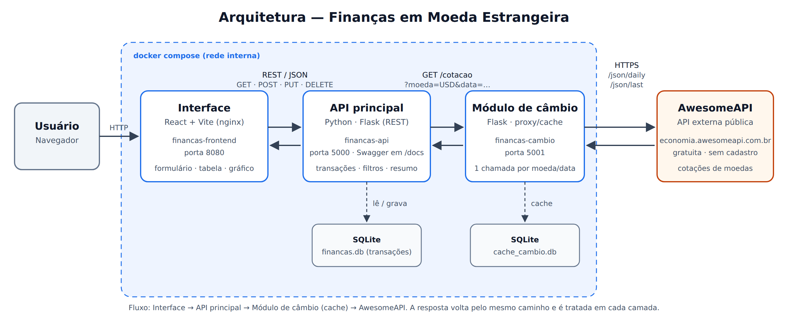

# Finanças em Moeda Estrangeira — Módulo de câmbio (proxy/cache)

Serviço **Python/Flask** que fornece cotações de moedas em reais para a
[API principal](https://github.com/gabrielamaiia01/financas-api). Ele consulta a
[AwesomeAPI](https://docs.awesomeapi.com.br/api-de-moedas) e guarda as cotações históricas em um
**cache SQLite**, para não repetir a chamada externa quando a mesma moeda e data forem consultadas
de novo.

| Repositório | Papel |
|---|---|
| [financas-frontend](https://github.com/gabrielamaiia01/financas-frontend) | Interface em React (contém o `docker-compose.yml` que sobe tudo) |
| [financas-api](https://github.com/gabrielamaiia01/financas-api) | API principal |
| **financas-cambio** (este) | Módulo proxy/cache de câmbio |

## Arquitetura



## Rotas

| Método | Rota | Descrição |
|---|---|---|
| `GET` | `/cotacao?moeda=USD&data=2026-08-14` | Cotação de fechamento na data. Em fim de semana ou feriado usa o último dia útil anterior (campo `data_cotacao`). Resultado vem do cache quando possível (`origem: "cache"`). |
| `GET` | `/cotacao?moeda=USD` | Cotação atual (não é guardada no cache). |
| `GET` | `/health` | Verificação de saúde. |

Exemplo de resposta:

```json
{ "moeda": "USD", "data": "2026-08-15", "data_cotacao": "2026-08-14", "valor": 5.43, "origem": "cache" }
```

| Código | Quando |
|---|---|
| `400` | Moeda ou data mal formatada, data futura, ou moeda que a AwesomeAPI não conhece |
| `404` | Nenhuma cotação na data nem nos 7 dias anteriores |
| `502` | A AwesomeAPI está fora do ar ou respondeu algo inesperado |

A cotação do **dia de hoje** não é guardada no cache, porque ainda pode mudar até o fechamento.

## Como executar

### Com Docker

```bash
docker build -t financas-cambio .
docker run -p 5001:5001 financas-cambio
```

Para subir a aplicação completa use o `docker-compose.yml` do repositório
[financas-frontend](https://github.com/gabrielamaiia01/financas-frontend).

### Ambiente de desenvolvimento

Pré-requisito: Python 3.10+.

```bash
python -m venv .venv
source .venv/bin/activate        # Windows: .venv\Scripts\activate
pip install -r requirements-dev.txt
python app.py                    # http://localhost:5001
```

### Variáveis de ambiente

| Variável | Padrão | Descrição |
|---|---|---|
| `CAMBIO_DATABASE_PATH` | `cache_cambio.db` (na pasta do projeto) | Arquivo do cache SQLite |
| `AWESOME_API_BASE_URL` | `https://economia.awesomeapi.com.br` | Endereço da API externa |

## Testes

```bash
pytest
```

## Estrutura

```
financas-cambio/
├── app.py                   # rota /cotacao
├── cache.py                 # cache SQLite
├── cliente_awesome_api.py   # chamadas à AwesomeAPI
├── config.py
├── Dockerfile
├── requirements.txt
├── requirements-dev.txt
├── docs/arquitetura.png
└── tests/
```

## API externa: AwesomeAPI

As cotações vêm da [AwesomeAPI — API de Cotações](https://docs.awesomeapi.com.br/api-de-moedas),
um serviço brasileiro **público e gratuito** com cotações de mais de 150 moedas.

| Item | Informação |
|---|---|
| **Site / documentação** | <https://docs.awesomeapi.com.br/api-de-moedas> |
| **Custo** | Gratuita |
| **Licença de uso** | Não há uma licença formal (ex.: MIT) publicada. O uso é livre e gratuito, sujeito aos termos e limites informados em [awesomeapi.com.br](https://awesomeapi.com.br) e no [aviso sobre limites](https://docs.awesomeapi.com.br/aviso-sobre-limites). |
| **Cadastro** | **Não é necessário.** Sem cadastro, as respostas vêm com cache de 1 minuto no lado da AwesomeAPI, o que é suficiente para este projeto. Opcionalmente, o cadastro gratuito gera uma [API Key](https://docs.awesomeapi.com.br/instrucoes-api-key) com 100 mil requisições por mês sem cache. |
| **Quem chama a API** | Apenas o módulo [financas-cambio](https://github.com/gabrielamaiia01/financas-cambio). A Interface e a API principal nunca falam direto com ela, e o usuário nunca é redirecionado para o site externo: os dados são consumidos, tratados e exibidos dentro da aplicação. |

### Rotas utilizadas

| Rota da AwesomeAPI | Uso no projeto |
|---|---|
| `GET https://economia.awesomeapi.com.br/json/daily/{MOEDA}-BRL/{dias}?start_date=AAAAMMDD&end_date=AAAAMMDD` | Cotação **histórica** de fechamento na data da compra (ex.: `/json/daily/USD-BRL/8?start_date=20260807&end_date=20260814`). Buscamos uma janela de 7 dias para usar o último dia útil quando a compra cai em fim de semana ou feriado. |
| `GET https://economia.awesomeapi.com.br/json/last/{MOEDA}-BRL` | Cotação **atual**, usada na comparação "se fosse hoje" (ex.: `/json/last/USD-BRL`). |

Campos usados da resposta: `bid` (valor de compra da moeda em reais), `timestamp` e `create_date`.
Quando a moeda não existe, a AwesomeAPI responde `404` (`CoinNotExists`), que o módulo de câmbio
transforma em uma mensagem clara para o usuário.
